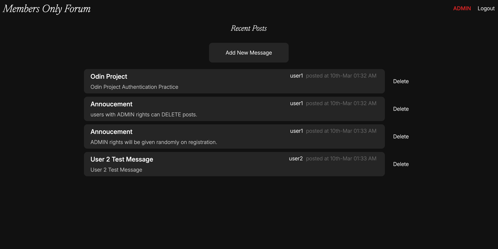

<h3 align="center">Members Only Forum</h3>

  

    Simple Members only forum with the ability to register and login using PassportJS authentication.  
     
    <a href="https://members-only-29to.onrender.com" target="_blank">Live Demo</a>
  

 

<!-- ABOUT THE PROJECT -->

### Preview

 

### Built With

<!-- ACKNOWLEDGMENTS -->

## Acknowledgments

- Inspiration by <a href="https://www.theodinproject.com/lessons/node-path-nodejs-members-only" target="_blank">The Odin Project</a>
